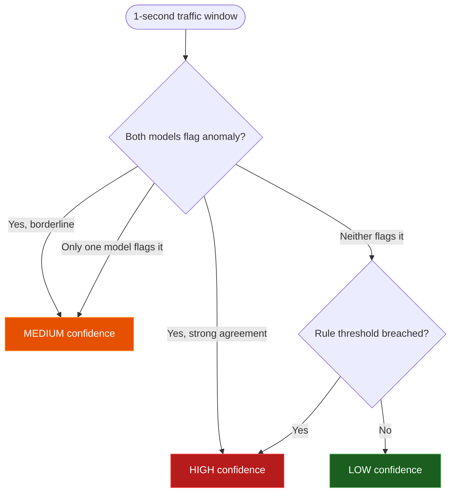

**I build detection tools — network IDS, behavioral EDR, and Wi-Fi monitoring — and evaluate them instead of just shipping them.**

---

## About

I'm a B.Tech CSE student specializing in Cyber Security. My work centers on **detection engineering** — building systems that turn raw telemetry (packets, process activity, wireless beacons) into actionable security signals — and on being honest about what a given detection technique can and can't tell you.

I gravitate toward projects with a measurable output: a confusion matrix, a labeled event log, a reproducible test harness. When I use machine learning, I try to be precise about what the model is actually estimating — an anomaly score is not a probability of malicious intent, and unsupervised detection means *unusual*, not *confirmed malicious*.

Currently looking for **SOC Analyst / Security Engineering internships** and open to collaborating on detection tooling.

---

## Selected Projects

Each project below focuses on a different layer of the detection stack, from network traffic to endpoint behavior to RF signals.

### 🛡️ [NetGuard AI](https://github.com/adicyb/NetGaurd-AI)
**Network intrusion detection using unsupervised anomaly detection**

Captures live traffic with Scapy, extracts features over 1-second windows, and scores them with an **Isolation Forest + One-Class SVM** ensemble trained on a baseline of the network's own traffic — no labeled attack dataset required. Agreement between the two models plus a rule layer (flood / scan / exfiltration heuristics) produces a HIGH / MEDIUM / LOW confidence tier, which is logged to SQLite and shown on a Streamlit dashboard. A built-in traffic simulator lets the detection logic be exercised and demoed without live attacks.

*Note: confidence tiers are a heuristic combination of model agreement and rule thresholds, not a calibrated probability of malicious activity.*

`Python` · `Scapy` · `scikit-learn` · `Streamlit` · `SQLite`

### 🔍 [ZeroSight EDR](https://github.com/adicyb/zerosight-edr)
**Behavioral endpoint detection, independent of signatures**

Collects real-time process telemetry via `psutil` and applies a behavioral risk-scoring engine to flag processes worth investigating, rather than matching against known-bad hashes or signatures. Findings surface on an interactive dashboard with manual process isolation and incident logging. Because it's behavior-based, it can surface processes that no signature exists for yet — but a high risk score is a lead for an analyst, not a confirmed verdict.

`Python` · `psutil` · `Streamlit` · `Plotly` · `SQLite`

### 📡 [WiFi Security IDS](https://github.com/adicyb/wifi-security-ids)
**Hardware-assisted Evil-Twin / rogue-AP detection**

An ESP8266 scans nearby Wi-Fi networks (SSID, BSSID, channel, RSSI) and applies on-device rule-based scoring to flag likely Evil Twin access points — BSSID conflicts on a known SSID, abnormal signal strength, and channel mismatches. Results are shipped over HTTP to a Flask server that logs events and renders alerts. This project demonstrates detection logic running directly on constrained hardware rather than a server-side pipeline.

`C++ (Arduino)` · `ESP8266` · `Flask` · `Python`

### 🧬 [Zero Fault Horizon](https://github.com/adicyb/zfh-core)
**Learned traffic rerouting on simulated network topologies**

Models network topologies with NetworkX, injects link failures, and trains a RandomForest classifier on a dataset generated by a rule-based "teacher" agent to reroute traffic around the failure. Reported path-prediction accuracy on the generated dataset is ~93% (not yet validated against real network conditions or an independent test environment). Included primarily to show systems/ML work outside pure intrusion detection — graph modeling, synthetic dataset generation, and classifier evaluation.

`Python` · `NetworkX` · `scikit-learn` · `Pandas`

---

## Technical Skills

**Languages** — Python, C/C++ (Arduino), Bash, SQL

**Cybersecurity & Network Analysis** — packet capture & analysis (Scapy), intrusion detection design, behavioral endpoint monitoring, Wi-Fi/Evil-Twin detection, rule-based threat classification, risk scoring, attack simulation

**Machine Learning & Data** — unsupervised anomaly detection (Isolation Forest, One-Class SVM), supervised classification (Random Forest), feature engineering, model evaluation, scikit-learn, Pandas

**Systems & Infrastructure** — Linux administration, Docker, AWS EC2, Git/GitHub

**Frameworks & Tooling** — Flask, Streamlit, Plotly, SQLite, NetworkX

---

## NetGuard AI — Detection Logic

The most technically distinct part of my work is how NetGuard AI turns two independent anomaly scores into a usable confidence tier:

This is a heuristic combining rule and disagreement between two unsupervised models — useful for triage, not a substitute for analyst review.

---

## GitHub Stats

---

## Contact

[LinkedIn](https://www.linkedin.com/in/aditya-khandelwal2006/) · [GitHub](https://github.com/adicyb)

